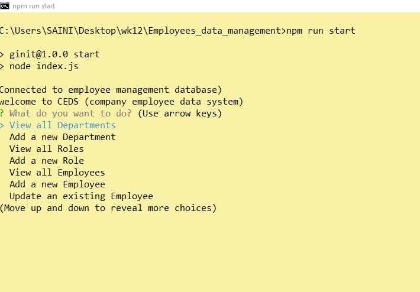
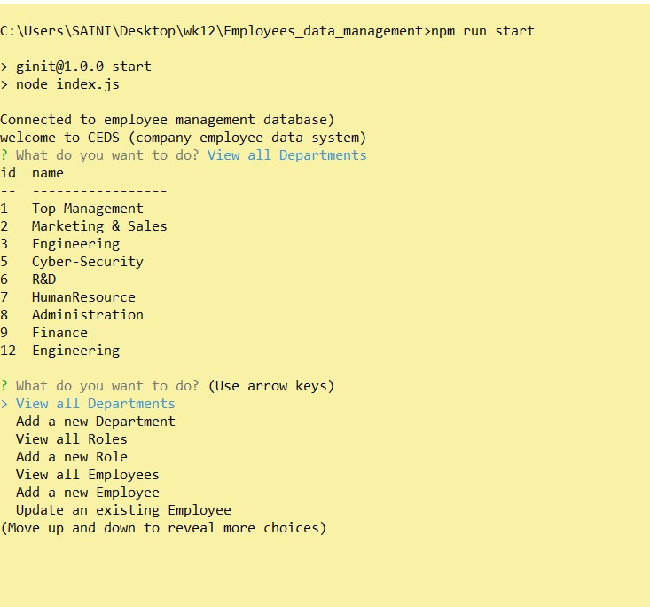
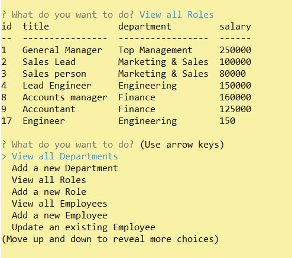
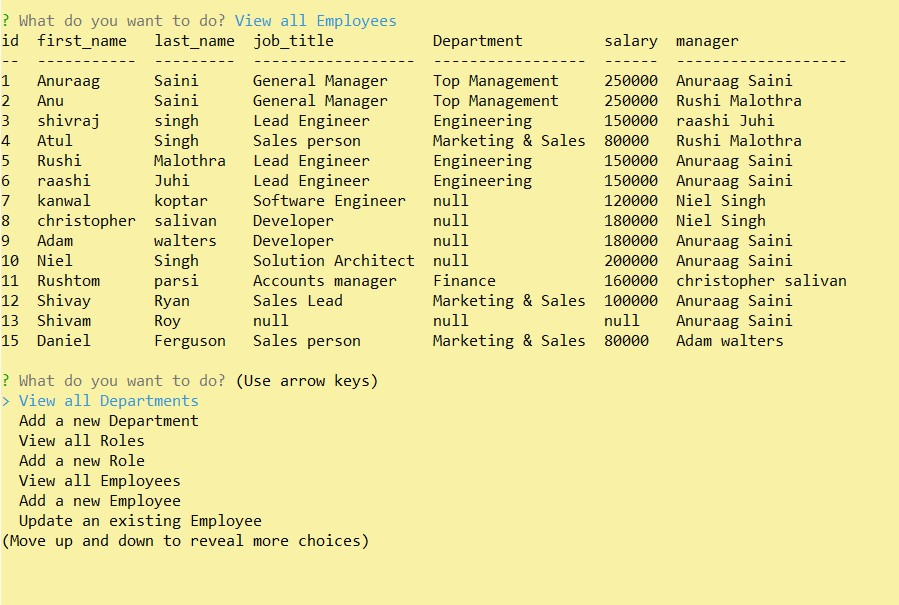

# Employees_data_management

The project has been developed as a Comman line interface for an organisation to store and retirve the information related to employees and departmentwise heirarchical organisation structure. It helps to enter employees employment details and reporting structure

# Table of Contents
1. [Description](#Description)
2. [Get_Started](#Get_Started)
3. [Images](#Images)
4. [Application](#Application)
4. [Questions](#Questions)

## Description 
This web-application has been built as backend for storing employees details and their reporting structure. In its current state the application is capable to viewing/adding departments, viewing/adding different roles within the department and viewing/adding /updating employees with their allocated roles , salary and reporting manager. The application uses MySQL for the database,inquirer and expressjs.   

## Get Started
you will need to clone repository from https://github.com/Anu-Saini/Employees_data_management.git

The project depandencies can be downloaded via npm package manager using ```npm install``` command. the application uses dependecies for express, inquirer, mySql.

## Images/Assets
The following images will depict the functionality of the APIs in the applicaton

### Main page


### All Departments


### All Available Roles/Job's 


### All Employees


## Application  
Since the application is a backend for retriving the data thro command line application, we use 'npm Run install'  to initiate the application

The walk through videos of the Creation, view and updation of records is available at the below links
https://drive.google.com/file/d/1xwv1ReLqJ8x-O-e0EC9fxikfrKsXrt2R/view


## Question / inquireies / suggestions 
For questions can be directed to us at the below addresses:
github Username: Anu-Saini
email: anuraagsaini@yahoo.co.in


